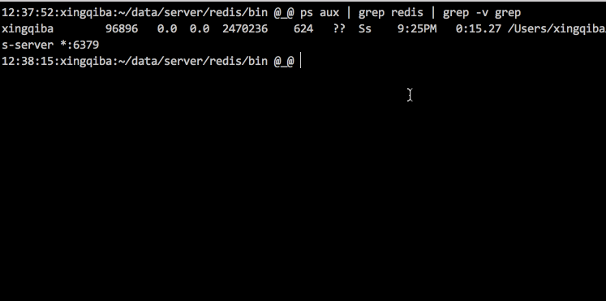

# tcpproxy


假设我们希望有一台机器A(ip 192.168.1.101)要开放端口6379给用户访问，但可能实际情况是用户无法直接访问到A(ip 192.168.1.101), 但却有一台机器B(ip 192.168.1.100) 可以开放一些其他端口给用户访问，为了让用户通过B(ip 192.168.1.100)能访问到A(ip 192.168.1.101)上6379端口，基于swoole实现的Tcpproxy解决了这个问题！ 当然你可以联想到我们家里的内部机器是在外网无法访问的，可正好你有一台云服务器，所以我们可以通过Tcpproxy实现外部访问你家里的内网应用, 说到这里你可以完全把它当成内网花生壳的功能. 按照上面描述的情况，配置我们的服务选项后如下


```php
//守护进程模式
$proxy_conf['daemonize'] = 0;
//开放给用户的公网的ip
$proxy_conf['public_ip'] = '192.168.1.100';
//开放给用户的公网的端口
$proxy_conf['public_port'] = 9999;
//代理内部中转端口
$proxy_conf['public_proxy_port'] = 6677;

//内部无法开放给公网的ip
$proxy_conf['local_ip'] = '192.168.1.101';
//内部无法开放给公网的端口
$proxy_conf['local_port'] = 6379;
//开放连接数
$proxy_conf['open_num'] = 10;
```

在B服务器运行
```
php proxy_server.php
```

在A服务器运行
```
php proxy_client.php
```

赶紧部署试试吧

##演示 

###为了在本机测试，我简化A,B为本地，通过本地9999访问本地6379应用,
```
//守护进程模式
$proxy_conf['daemonize'] = 0;
//开放给用户的公网的ip
$proxy_conf['public_ip'] = '127.0.0.1';
//开放给用户的公网的端口
$proxy_conf['public_port'] = 9999;
//代理内部中转端口
$proxy_conf['public_proxy_port'] = 6677;

//内部无法开放给公网的ip
$proxy_conf['local_ip'] = '127.0.0.1';
//内部无法开放给公网的端口
$proxy_conf['local_port'] = 6379;
//开放连接数
$proxy_conf['open_num'] = 10;
```




##模拟内网花生壳功能时使用要点
* 需要一台有公网ip运行proxy_server.php开放给用户访问
* 在你的内网运行proxy_client.php来代理你的应用

##为了调试更方便，对于内内网无php&swoole环境的，我们提供了sproxy，功能同proxy_client.php
```c
make
#单以多进程模式运行
./sproxy_process -s 127.0.0.1:6677 -t 127.0.0.1:6379 -c 10 -d
#或以多进程多线程模式运行
./sproxy_thread -s 127.0.0.1:6677 -t 127.0.0.1:6379 -c 10 -d
```
* -d 指定以守护进程模式运行
* -s 指定proxy_server.php内部地址和端口
* -t 指定需要代理app运行地址和端口
* -c 指定开启进程数量

更多疑问请+qq群 233415606 or [website http://xingqiba.sinaapp.com](http://xingqiba.sinaapp.com)
